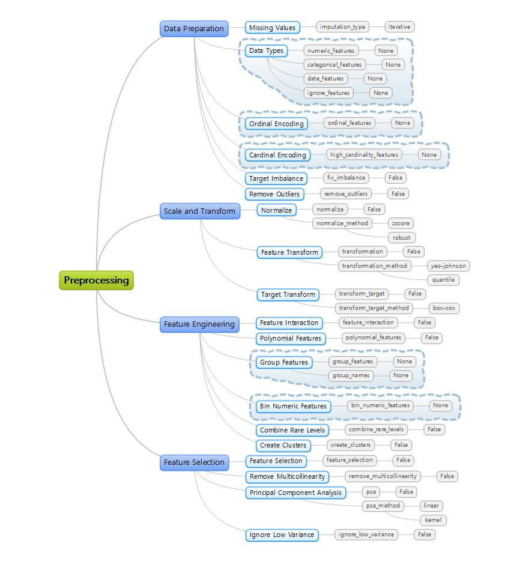

# Hackathon 2022

## Datasets

* Classification
  - [Kaggle] [UCI SECOM Dataset](https://www.kaggle.com/datasets/paresh2047/uci-semcom)
  - [Kaggle] [IBM HR Analytics Employee Attrition & Performance](https://www.kaggle.com/datasets/pavansubhasht/ibm-hr-analytics-attrition-dataset)
  - [Kaggle] [Pima Indians Diabetes Database](https://www.kaggle.com/datasets/uciml/pima-indians-diabetes-database)
  - [Kaggle] [Titanic - Machine Learning from Disaster](https://www.kaggle.com/competitions/titanic)

* Regression
  - [Kaggle] [Mercedes-Benz Greener Manufacturing](https://www.kaggle.com/c/mercedes-benz-greener-manufacturing)
  - [Kaggle] [The Boston Housing Dataset](https://www.kaggle.com/code/prasadperera/the-boston-housing-dataset/notebook)

* Time Series
  - [Kaggle] [Household Electric Power Consumption](https://www.kaggle.com/datasets/uciml/electric-power-consumption-data-set)

## Preprocessing

### Selected Methods


## Basic Codes

### Classification

```python
from pycaret.datasets import get_data
import pycaret.classification as clf
import pickle

juice = get_data('juice')
session = clf.setup(data=juice, target='Purchase', silent=True, verbose=False)

topk = clf.compare_models(n_select=3, include=['rf', 'gbc', 'et'])
topk_tuned = [clf.tune_model(model) for model in topk]

bagger = [clf.ensemble_model(model, method='Bagging') for model in topk_tuned]
booster = [clf.ensemble_model(model, method='Boosting') for model in topk_tuned]
blender = clf.blend_models(topk_tuned)
stacker = clf.stack_models(topk_tuned)

best_automl = clf.automl(optimize='AUC')
best_automl = clf.finalize_model(best_automl)

best_model = clf.get_config('prep_pipe')
best_model.steps.append(['trained_model', best_automl])
print(">>", type(best_model.steps[-1][-1]))

## pipeline = preprocessor + model
clf.save_model(best_model, 'prep_model')
prep_model = clf.load_model('prep_model')

pickle.dump(prep_model, open('pipeline.pkl', 'wb'))
pipeline = pickle.load(open('pipeline.pkl', 'rb'))
```

### Imbalanced Class

* Weighted Class
* Under-sampling
* Over-sampling

### Regression

```python
from pycaret.datasets import get_data
import pycaret.regression as reg

boston = get_data('boston')
session = reg.setup(data=boston, target='medv', silent=True, verbose=False)

topk = reg.compare_models(n_select=3, include=['rf', 'gbr', 'et'])
topk_tuned = [reg.tune_model(model) for model in topk]

bagger = [reg.ensemble_model(model, method='Bagging') for model in topk_tuned]
booster = [reg.ensemble_model(model, method='Boosting') for model in topk_tuned]
blender = reg.blend_models(topk_tuned)
stacker = reg.stack_models(topk_tuned)

best_automl = reg.automl(optimize='MAE')
best_automl = reg.finalize_model(best_automl)

best_model = reg.get_config('prep_pipe')
best_model.steps.append(['trained_model', best_automl])
print(">>", type(best_model.steps[-1][-1]))

## pipeline = preprocessor + model
reg.save_model(best_model, 'prep_model')
prep_model = clf.load_model('prep_model')

pickle.dump(prep_model, open('pipeline.pkl', 'wb'))
pipeline = pickle.load(open('pipeline.pkl', 'rb'))
```

### Add a new metric

```python
def calculate_profit(y, y_pred):
    tp = np.where((y_pred==1) & (y==1), (120-15), 0)
    fp = np.where((y_pred==1) & (y==0), -15, 0)
    fn = np.where((y_pred==0) & (y==1), -120, 0)
    return np.sum([tp, fp, fn])

add_metric('profit', 'Profit', calculate_profit, greater_is_better=True)
```

## References

* Official Documents
  - https://pycaret.gitbook.io/docs/
  - https://pycaret.gitbook.io/docs/get-started/tutorials
  - https://pycaret.gitbook.io/docs/learn-pycaret/examples

* API Reference
  - https://pycaret.readthedocs.io/en/latest/api/classification.html
  - https://pycaret.readthedocs.io/en/latest/api/regression.html
  
* Tutorials
  - [Pycaret Classification Tutorial for Beginners](https://dacon.io/codeshare/2428)
  - [Pycaret Classification Tutorial for Intermediate](https://dacon.io/codeshare/2430)
  - [How to deal with Class Imbalance in Python](https://vitalflux.com/class-imbalance-class-weight-python-sklearn/)
  - [Balanced Weights For Imbalanced Classification](https://medium.com/grabngoinfo/balanced-weights-for-imbalanced-classification-465f0e13c5ad)
  - [Classification Problem Using PyCaret](https://blog.devgenius.io/classification-problem-using-pycaret-cd34885b4cda)
