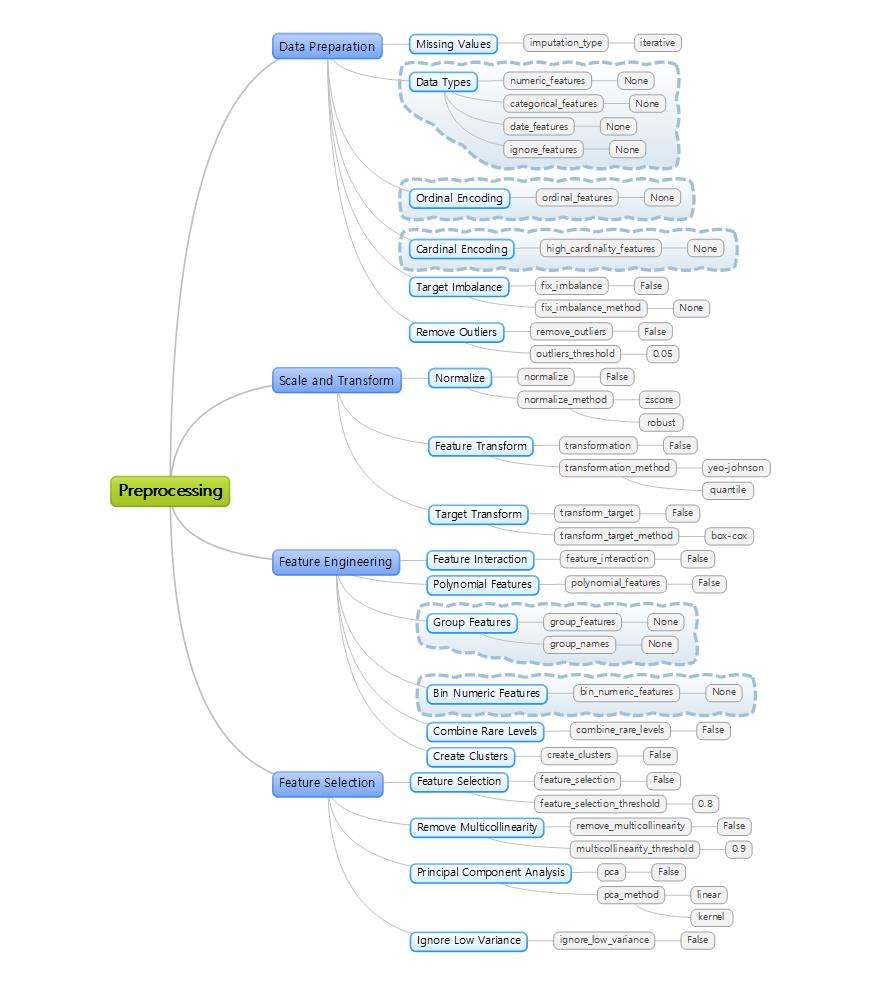

# Hackathon 2022

## Datasets

* Classification
  - [Kaggle] [UCI SECOM Dataset](https://www.kaggle.com/datasets/paresh2047/uci-semcom)
  - [Kaggle] [IBM HR Analytics Employee Attrition & Performance](https://www.kaggle.com/datasets/pavansubhasht/ibm-hr-analytics-attrition-dataset)
  - [Kaggle] [Pima Indians Diabetes Database](https://www.kaggle.com/datasets/uciml/pima-indians-diabetes-database)
  - [Kaggle] [Titanic - Machine Learning from Disaster](https://www.kaggle.com/competitions/titanic)

* Regression
  - [Kaggle] [Mercedes-Benz Greener Manufacturing](https://www.kaggle.com/c/mercedes-benz-greener-manufacturing)

* Time Series
  - [Kaggle] [Household Electric Power Consumption](https://www.kaggle.com/datasets/uciml/electric-power-consumption-data-set)

## Preprocessing

### Selected Methods

## References

* Official Documents
  - https://pycaret.gitbook.io/docs/
  - https://pycaret.gitbook.io/docs/get-started/tutorials
  - https://pycaret.gitbook.io/docs/learn-pycaret/examples

* API Reference
  - https://pycaret.readthedocs.io/en/latest/api/classification.html
  - https://pycaret.readthedocs.io/en/latest/api/regression.html
